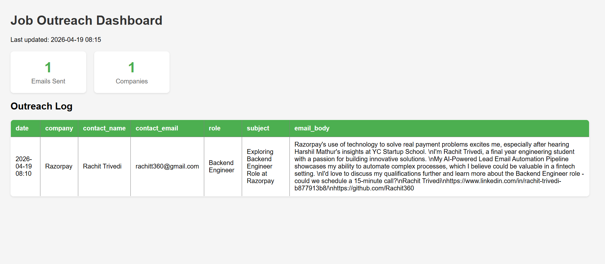
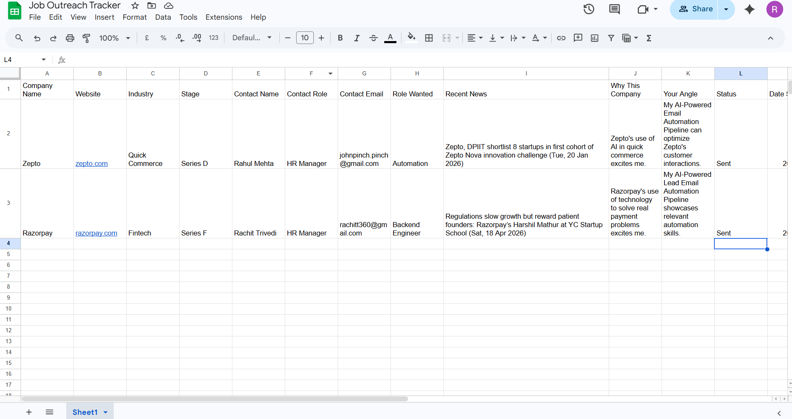

# 🤖 AI-Powered Job Outreach Automation Pipeline

> Stop applying blindly on job portals. Cold email startup founders and HRs directly with personalized, research-backed emails — generated and sent automatically using AI.

---

## 📸 Dashboard Preview



---

## 📊 Google Sheet Tracker



---

## 💡 The Problem This Solves

Most students apply to jobs by uploading a resume on Naukri or LinkedIn and waiting. Cold emailing startup founders directly is far more effective — but writing personalized emails for 20 companies takes hours.

This pipeline automates the entire process. You do the research once (3-5 minutes per company), and the system handles everything else — fetching news, generating personalized emails using AI, sending them, and tracking replies.

**Result: 20 personalized cold emails sent in the time it used to take to write one.**

---

## ⚙️ How It Works

```
You fill company info (Columns A to H)
            ↓
auto_research.py runs automatically
— scrapes company website for description
— fetches recent news via Google News RSS
— sends data to Groq AI to fill Why This Company + Your Angle
            ↓
You review the sheet
— check if news and angle make sense
— set Status = Approved for rows you're happy with
            ↓
generate_emails.py sends emails
— generates personalized cold email using Groq AI
— sends via Gmail SMTP
— BCCs you automatically on every email
— updates Status to Sent and fills Date Sent
— logs everything to CSV
            ↓
python dashboard.py
— generates visual HTML dashboard from outreach log
```

---

## 📁 Project Structure

```
AI-Powered-Job-Outreach-Automation-Pipeline/
├── auto_research.py       — fetches news, scrapes websites, uses Groq AI to fill research columns
├── generate_emails.py     — generates and sends personalized cold emails via Gmail
├── setup_sheet.py         — one-time Google Sheet setup script
├── dashboard.py           — generates a visual HTML dashboard from outreach log
├── requirements.txt       — all Python dependencies
├── .env.example           — environment variable template
└── README.md              — you are here
```

---

## 🗂️ Google Sheet Structure

| Column | Name | Who Fills It |
|--------|------|-------------|
| A | Company Name | You |
| B | Website | You |
| C | Industry | You |
| D | Stage | You (Seed / Series A / Bootstrapped) |
| E | Contact Name | You |
| F | Contact Role | You (HR / Founder / CTO) |
| G | Contact Email | You |
| H | Role Wanted | You |
| I | Recent News | ✅ Auto — Google News RSS |
| J | Why This Company | ✅ Auto — Groq AI |
| K | Your Angle | ✅ Auto — Groq AI |
| L | Status | You — type Approved when ready |
| M | Date Sent | ✅ Auto — after email is sent |
| N | Reply Received | You — update manually |

---

## 🚀 Setup

### 1. Clone the repository
```bash
git clone https://github.com/Rachit360/AI-Powered-Job-Outreach-Automation-Pipeline.git
cd AI-Powered-Job-Outreach-Automation-Pipeline
```

### 2. Install dependencies
```bash
pip install -r requirements.txt
```

### 3. Set up environment variables
Copy `.env.example` to `.env` and fill in your actual values:
```
GROQ_API_KEY=your_groq_api_key
MY_EMAIL=your_gmail_address
GMAIL_APP_PASSWORD=your_gmail_app_password
NEWS_API_KEY=your_newsapi_key
MY_NAME=your_full_name
MY_LINKEDIN=your_linkedin_url
MY_GITHUB=your_github_url
MY_PORTFOLIO=your_portfolio_url
SHEET_NAME=your_google_sheet_name
```

> Get your free Groq API key at [console.groq.com](https://console.groq.com)
> Get your free NewsAPI key at [newsapi.org](https://newsapi.org)
> Gmail App Password: Google Account → Security → 2FA → App Passwords

### 4. Set up Google Sheets API
- Create a Google Cloud project
- Enable Google Sheets API and Google Drive API
- Create a Service Account and download `credentials.json`
- Place `credentials.json` in the project root
- Share your Google Sheet with the service account email

### 5. Edit your personal context
Open `auto_research.py` and find `MY_PERSONAL_CONTEXT`. Fill in your actual projects and skills. This is what Groq uses to generate your angle for each company.

Three profiles are available — switch between them by changing one line:
```python
MY_PERSONAL_CONTEXT = PROFILE_AI_AUTOMATION    # for AI/automation roles
MY_PERSONAL_CONTEXT = PROFILE_DEVELOPMENT      # for SDE/backend roles
MY_PERSONAL_CONTEXT = PROFILE_DATA_ANALYST     # for data analyst roles
```

---

## 📋 Your Weekly Workflow

**Sunday (30-45 minutes)**
1. Research 10-15 startups — find company name, website, HR/founder email
2. Fill columns A-H in your Google Sheet

**Run auto research**
```bash
python auto_research.py
```
Automatically fills Recent News, Why This Company, Your Angle

**Review and approve**
- Open your Google Sheet
- Read through the auto-filled columns
- Edit anything that looks wrong
- Type `Approved` in column L for rows you're happy with

**Send emails**
```bash
python generate_emails.py
```
Sends personalized emails to all Approved rows

**Generate dashboard**
```bash
python dashboard.py
```
Open `dashboard.html` in your browser to see your outreach stats

---

## 🛠️ Tech Stack

| Tool | Purpose |
|------|---------|
| Python | Core language |
| Groq API (Llama 3.3) | AI email generation and research filling |
| Google Sheets API (gspread) | Data storage and outreach tracking |
| Gmail SMTP | Automated email sending |
| BeautifulSoup | Company website scraping |
| Google News RSS | Automated recent news fetching |
| NewsAPI | News search fallback |
| pandas | Dashboard data processing |
| python-dotenv | Environment variable management |

---

## ✅ Key Features

- **Automated research** — scrapes company website and fetches recent news automatically
- **AI personalization** — Groq generates Why This Company and Your Angle per company
- **Multi-profile system** — three role-based profiles (Data Analyst, Development, AI Automation)
- **Few-shot prompting** — email generation uses real cold email examples for better output
- **Manual approval gate** — nothing sends until you review and approve
- **Auto BCC** — every email sent to a company also lands in your own inbox
- **Full tracking** — CSV log + visual HTML dashboard

---

## ⚠️ Important Notes

- Never commit your `.env` or `credentials.json` to GitHub
- Always review AI-generated emails before setting Status to Approved
- Gmail App Password is required — your regular Gmail password will not work
- NewsAPI free tier allows 100 requests per day
- Google News RSS works best for Indian startups
- Tested on Windows with Python 3.13

---

## 🔮 Planned Improvements

- Auto follow-up after 7 days if no reply
- Automatic profile switching based on company industry
- Better news relevance for lesser known startups
- Reply detection and auto-logging

---

## 📄 License

MIT License — free to use and modify for your own job search.

---

*Built by [Rachit Trivedi](https://github.com/Rachit360)*